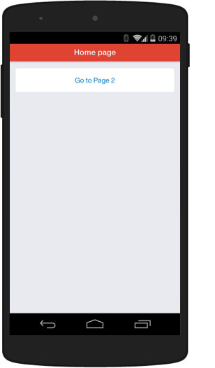

# Kik Starter Kit [](https://usekite.com/deploy)

Starter Kit contains the necessary foundations to get you started on building Kik apps. 




### Make It Your Own / Cloud Setup

  1. Fork this repository
  2. Make edits with your favorite tools, and commit your code
  3. Click the **Live Demo** button on your repository to view the results of your changes.
  4. Share your app with your friends on Kik Messenger! The link is provided to you when you click on the **Live Demo** button.  

**Note:** To use the **Live Demo** button on your own fork, you will need to sign up for a Kite account. To sign up, simply, click the **Live Demo** button on your own repository.   


### Local Setup

  1. Install Node.js (v0.8+) from [http://nodejs.org/](http://nodejs.org/)
  2. From the command line, run these commands:

    ```sh
    git clone git://github.com/kikinteractive/starter-kit.git
    cd starter-kit
    npm install
    ```


### Run debug server

1. Run this command: `npm start`
2. Go to [localhost:5000](http://localhost:5000/) in your browser to see your app


### Kik Developer Resources

All developer resources can be found on [dev.kik.com](http://dev.kik.com/).


### Copyright and License

Code released under the MIT license. Code and documentation copyright 2014 Kik Interactive, Inc.
